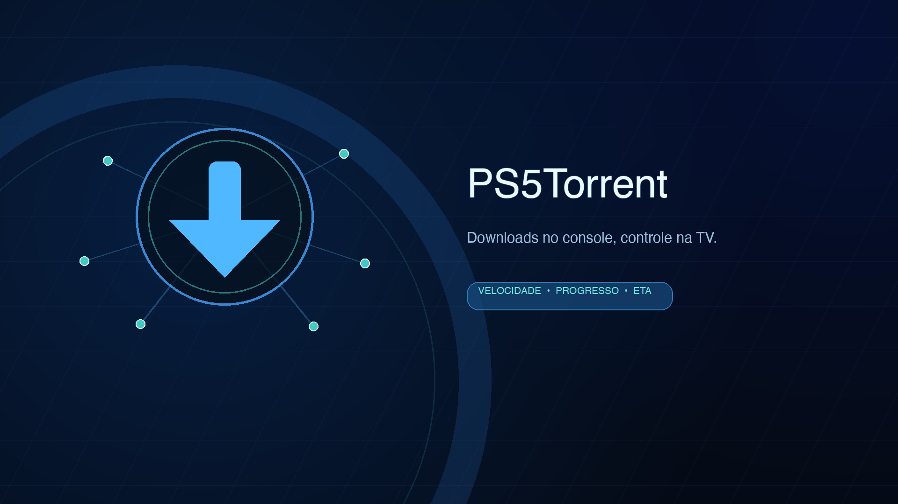

<p align="center">
  
</p>

<h1 align="center">PS5Torrent</h1>

<p align="center">
  Um cliente BitTorrent para PS5 com painel web, acompanhamento em tempo real
  e aplicativo próprio na tela principal do console.
</p>

<p align="center">
  <a href="https://github.com/jfcardososantos/PS5Torrent/releases/tag/v1.0.0"></a>
  <a href="https://github.com/jfcardososantos/PS5Torrent/actions/workflows/build.yml"></a>
  
  
  
</p>

<p align="center">
  <a href="#downloads">Downloads</a> •
  <a href="#recursos">Recursos</a> •
  <a href="#como-usar">Como usar</a> •
  <a href="#compilação">Compilação</a>
</p>

> [!IMPORTANT]
> Projeto experimental destinado a pesquisa e homebrew. Use somente torrents
> de conteúdo que você tem autorização para baixar. Requer um PS5 com ambiente
> de homebrew compatível; não utilize uma conta PSN importante durante testes.

## Downloads

A versão 1.0 é distribuída de duas formas:

| Arquivo | Quando usar |
| --- | --- |
| `PS5Torrent-v1.0.0.pkg` | Instala o PS5Torrent com ícone próprio na tela principal. |
| `ps5_torrent-v1.0.0.elf` | Envio direto para um ELF loader nas portas 9021/9020. |
| Source code | Código completo em `.zip` ou `.tar.gz`, gerado pelo GitHub. |

Os binários oficiais ficam nos assets da página
**[Releases](https://github.com/jfcardososantos/PS5Torrent/releases/tag/v1.0.0)**.
O fPKG é uma
imagem debug experimental e sua instalação depende do firmware e do ambiente
homebrew utilizado no console.

## Recursos

- painel responsivo preparado para TV, navegador do PS5 e controle;
- progresso, velocidade, tamanho restante, ETA e peers em tempo real;
- upload de arquivos `.torrent` pelo navegador;
- metainfo single-file e multi-file;
- trackers HTTP e UDP (IPv4/BEP 15), disponibilidade de peças (bitfield/HAVE), choke/unchoke e blocos de até 16 KiB;
- fallback por web seed HTTP (`url-list`/BEP 19) quando o swarm não fornece peer útil;
- montagem e verificação SHA-1 da peça completa antes de confirmar a gravação, incluindo peças que cruzam arquivos;
- seleção de armazenamento USB, M.2/NVMe ou interno disponível;
- notificação do sistema com o endereço do painel;
- instalação em Mídias e mensagem de pronto, sem abertura automática;
- identificação do payload ativo como `PS5Torrent.elf` no Payload Manager;
- fPKG com ícone e arte próprios para a tela principal;
- diagnóstico do console diretamente pelo macOS;
- build reproduzível com o ps5-payload-sdk v0.41.

<p align="center">
  
</p>

## Como usar

### Aplicativo instalado

Execute `PS5Torrent.elf` pelo loader. Ele instala o PKG incorporado em
**Mídias** e mostra uma mensagem quando estiver pronto. Abra o aplicativo
manualmente na aba Mídias. O ícone usa o painel local na
porta 12389; mantenha o ELF ativo e execute-o novamente após reiniciar o console.

Em **Novo torrent → Escolher arquivo .torrent**, navegue nas pastas do PS5
até selecionar o arquivo. O painel não usa o seletor nativo do navegador do
console. Pelo computador/celular, também há um botão separado para upload.
O limite do arquivo de metadados é 1 MB, sem limitar o tamanho do download.

O botão **Logs**, ao lado de **Novo torrent**, abre uma tela preta com texto
branco e atualização a cada dois segundos. Os eventos são registrados em inglês,
com data/hora UTC, em `/data/PS5Torrent/PS5Torrent.log`. Ao atingir 1 MB, o
arquivo anterior é mantido como `PS5Torrent.previous.log`. A tela mostra os
últimos 64 KB. Se a gravação não estiver disponível, ela informa o problema e
mostra os eventos em memória. Depois de uma queda, consulte o arquivo salvo.

Em **Salvar em**, selecione um atalho e clique em **Outro caminho** para
navegar pelas pastas a partir dele. Confirme com **Usar esta pasta**.
**Criar pasta** abre o teclado apenas para o nome da nova subpasta; após
criá-la, confirme se ela será o destino. Cancelar mantém o destino anterior.

O idioma do PS5 seleciona automaticamente português (Brasil/Portugal), inglês
ou espanhol. Outros idiomas usam inglês. Até receber o idioma do console,
o painel usa o idioma do navegador.

### Payload ELF

Com um loader ouvindo na porta 9021:

```bash
export PS5_HOST=192.168.1.100
export PS5_PORT=9021
make test
```

O ELF pronto fica na raiz do projeto como `PS5Torrent.elf`. No Payload Manager,
use esse mesmo nome para que a identificação da instância ativa corresponda
ao arquivo. Ao iniciar, o payload instala o PKG v2.0.4 e avisa quando estiver
pronto. Abra o PS5Torrent manualmente em Mídias.

Também é possível selecionar `PS5Torrent.elf` em um aplicativo de envio de
payloads. Depois do carregamento, acesse:

```text
http://IP_DO_PS5:12389/
```

Para confirmar pelo Mac o que está respondendo:

```bash
./scripts/check_ps5.sh 192.168.1.100
```

O diagnóstico testa o painel na porta 12389 e os loaders nas portas 9021 e
9020. Quando o serviço está ativo, o estado da API é mostrado no terminal.

## Compilação

### macOS

Pré-requisitos:

- macOS com Command Line Tools (`xcode-select --install`);
- [Homebrew](https://brew.sh).

Prepare o SDK e compile o ELF:

```bash
./setup.sh
```

O script instala/verifica `llvm@18` e `socat`, baixa o ps5-payload-sdk v0.41,
confere seu SHA-256 e gera `PS5Torrent.elf`. Tudo permanece dentro do projeto,
sem `sudo` e sem alterações no `.zshrc`.

Comandos adicionais:

```bash
make                       # recompila o ELF
make clean all             # build limpo
./setup.sh --no-deps       # não executa brew install
./setup.sh --sdk-only      # prepara apenas o SDK
```

### Gerar o fPKG no Mac

O pacote de Mídias já acompanha o código. Para conferir e preparar a distribuição:

```bash
./scripts/build_pkg_macos.sh
```

O ELF compilado e o mesmo PKG incorporado ficam em `dist/`. Para recriar o
pacote após alterar as imagens ou metadados, use `python scripts/build_media_pkg.py`
com `prospero-pub-cmd` disponível. Consulte [pkg/TILE.md](pkg/TILE.md).

O ELF prepara as próprias permissões, credenciais e raiz do sistema de arquivos
pelas APIs locais do ps5-payload-sdk, seguindo o Spectrum Library. Não utiliza
servidor de comandos do etaHEN nem exige as opções Network/Legacy CMD server.
O loader e o ambiente homebrew precisam oferecer suporte às APIs do SDK.

## Limitações da versão 2.0.4

- magnet links ainda não baixam metadados BEP-9; use arquivos `.torrent`;
- trackers/web seeds HTTPS, DHT, PEX, MSE/PE e retomada não estão implementados;
- transferência usa um bloco pendente por peer; buffers de montagem compartilham um limite de 64 MiB, com erro explícito para peças maiores;
- o painel não possui autenticação e deve ficar em uma rede local confiável;
- compatibilidade do fPKG varia conforme firmware, jailbreak e instalador;
- a versão ainda precisa de validação mais ampla em hardware real.

## Estrutura do projeto

```text
.
├── .github/workflows/     # integração contínua
├── include/               # headers C
├── src/                   # cliente, servidor HTTP e painel incorporado
│   └── web/index.html     # fonte editável da interface
├── pkg/                   # metadados, ícone e artes do aplicativo
├── scripts/               # build, diagnóstico e utilitários
├── tools/                 # empacotador fPKG para macOS
├── Makefile               # build do payload
└── setup.sh               # preparação reproduzível do ambiente
```

## Segurança e uso responsável

O PS5Torrent não inclui conteúdo, catálogos ou mecanismos de busca. O usuário é
responsável pelos torrents adicionados e pelo cumprimento das leis e licenças
aplicáveis. Homebrew pode violar os termos de serviço da Sony e expor o console
a riscos.

## Licença

Distribuído sob a licença [GPL-3.0](LICENSE).
