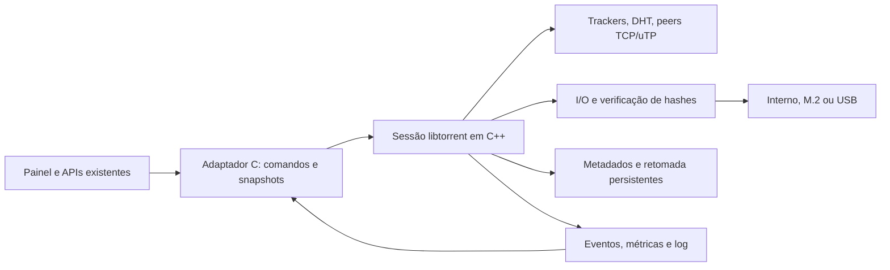

# PS5Torrent — plano de compatibilidade e desempenho

Levantamento de 06/09/2026. Código avaliado: `ed89a15ec553cf30b2fd47690934971d87f3e547`.
Este documento propõe a execução; a migração do motor ainda não foi implementada.

**Recomendação revisada**

Usar o projeto local
`C:/Users/Phoenix/Downloads/Telegram Desktop/EZLL-TORRENT copy/EZHELIT-TORRENT copy`
como referência PS5 validada e trazer essa linha para o plano do PS5Torrent.
O caminho mais realista passa a ser: partir da porta de **libtorrent-rasterbar
2.0.12** que já executou no console, reproduzir um ELF mínimo no nosso build e,
com essa base comprovada, decidir se vale subir para **2.1.1** ou manter 2.0.x
na primeira entrega.

Preservar o painel, as APIs de arquivos/destinos, o instalador de Mídias e o
fluxo do ELF do PS5Torrent. Delegar ao novo motor protocolo, descoberta,
agendamento de blocos, armazenamento e retomada. Como o projeto local não contém
uma licença clara para o código próprio, tratar seus arquivos como referência
técnica e reaproveitar de forma direta apenas dependências upstream, configurações
reproduzíveis e patches mínimos cuja origem/licença possa ser registrada.

A biblioteca já oferece v1/v2/híbridos, magnets, DHT, PEX, uTP e retomada. Isso
reduz a quantidade de protocolos que teríamos de desenvolver e manter. A diferença
agora é que existe uma porta PS5 próxima do objetivo, com sessão libtorrent,
metadata exchange, DHT/LSD/PEX/uTP, escrita em `/data`, verificação e fast resume
registrados como validados no PS5. A integração no PS5Torrent ainda precisa ser
implementada e testada com a identidade, paths e interface atuais.
[Recursos oficiais](https://www.libtorrent.org/features-ref.html).

“Qualquer torrent” deve virar uma matriz verificável: formatos válidos, fontes
alcançáveis, permissões de tracker disponíveis e recursos explicitamente
suportados. Nenhum motor consegue concluir um torrent sem as peças necessárias
disponíveis, nem superar a menor capacidade entre fontes, rede e armazenamento.
Trackers privados também podem ter regras de admissão de clientes.

**O que limita o projeto hoje**

| Evidência no código atual | Efeito | Trabalho necessário |
| --- | --- | --- |
| `src/torrent_mgr.c:1202` e `1222`: um pedido pendente de 16 KiB por peer | Cada pedido espera a resposta anterior; latência derruba a vazão | Janela adaptativa de pedidos, respostas fora de ordem, reenvio por bloco |
| `src/main.c:675` e `694`: poll HTTP de 5 ms seguido de espera de 10 ms | Transferência depende do ritmo do painel | Motor de rede independente, orientado a eventos |
| `src/torrent_mgr.c:1180`, `1190` e `src/piece_mgr.c:79` | SHA-1 calculado duas vezes por peça; hash e escrita no thread principal | Verificação única e I/O assíncrono com filas limitadas |
| `src/file_io.c:110` em diante | Multifile procura offsets e abre/fecha arquivos repetidamente | Índice de arquivos, cache limitado de descritores e escrita por offset |
| `src/file_io.c:71`: `O_TRUNC`; reinício recria mapa de peças | Não existe retomada real; reiniciar pode truncar arquivo parcial | Persistência consistente, recheck e preservação dos dados existentes |
| Parser SHA-1 v1 e erro explícito para metadata magnet | Falham v2 puro e download por magnet | Parser maduro; SHA-256/Merkle; BEP 9/10/52 |
| Porta 6881 anunciada sem listener torrent; conclusão fecha peers | Sem conexões entrantes nem seeding funcional | Listener, upload, eventos e contabilidade de sessão |
| Flag `private` ausente; lista de trackers perde os tiers | Não há implementação completa de torrent privado | Preservar tiers e regras de privacidade antes de habilitar DHT/PEX |
| Buffers de web seed fora do orçamento de 64 MiB dos peers | O paralelismo pode consumir muito mais memória que o limite anunciado | Orçamento global de buffers, metadados, peers e tarefas |
| `src/app_log.c:45`: escrita e `fflush` sob mutex | Log pode atrasar o caminho de transferência | Fila limitada, agregação e flush periódico; erros continuam visíveis |
| Velocidade calculada apenas após concluir peças | Medidor pode alternar entre zero e saltos | Separar bytes de rede, verificados e gravados; média móvel |
| Corpo HTTP de 1 MiB; máximo de 1024 arquivos; parser sem alguns limites de overflow/recursão | Metadados grandes rejeitados e entrada malformada exige robustez adicional | Limites configuráveis por orçamento, parser validado e fuzzing |

Exemplo calculado, **não medição do PS5**: com um bloco de 16 KiB em voo e RTT de
100 ms, a ordem de grandeza do teto por peer é `16 KiB / 0,1 s = 160 KiB/s`.
Mesmo em LAN, um ciclo de aproximadamente 15 ms restringe a cerca de 1,04 MiB/s
por peer nesse modelo. A especificação recomenda vários pedidos em fila.
[BEP 3](https://www.bittorrent.org/beps/bep_0003.html).

O log disponível em `C:/Projects/PS5Torrent.log`, modificado em 06/09 às 13:10,
contém mensagens anteriores às últimas melhorias. Ele não mede o desempenho do
ELF mais recente. O primeiro benchmark precisa identificar build e commit.

**Matriz de compatibilidade pretendida**

| Caso | Situação atual | Critério para considerar suportado |
| --- | --- | --- |
| `.torrent` v1, um ou vários arquivos | Implementação básica | Download completo, arquivos vazios, limites entre arquivos e hashes corretos |
| `.torrent` v2 puro e híbrido | Sem v2; híbrido pode usar apenas a parte v1 | SHA-256, árvores de hashes, identificadores v1/v2 e deduplicação corretos |
| Magnet `btih` hexadecimal/base32 e `btmh` | Download de metadados ausente | Descobrir peers, obter/validar metadados e concluir sem `.torrent` local |
| Trackers HTTP, HTTPS e UDP | HTTP/UDP IPv4 | TLS válido, redirects, respostas compactas e por dicionário, tiers e intervalos |
| DHT, PEX e descoberta local | Ausentes | Encontrar peers em cenários isolados e respeitar limites/privacidade |
| TCP e uTP | TCP IPv4 | Conectar, transferir, controlar congestionamento e recuperar perdas |
| IPv4 e IPv6 | IPv4 | DNS, bind, conexão, tracker e descoberta testados por família |
| MSE/PE | Ausente | Interoperar com peers que exigem negociação de criptografia |
| Torrent privado | Incompleto | Respeitar `private=1`, tracker autorizado, tiers, upload e eventos |
| Web seeds HTTP/HTTPS BEP 19 | HTTP com lotes | TLS, Range, multifile, redirects e reutilização de conexões |
| Pausa, reinício e verificação | Sem persistência real | Preservar dados e retomar somente peças válidas |
| Seeding e seleção de arquivos | Ausentes/incompletos | Upload validado por outro cliente, prioridades e espaço em disco corretos |
| WebTorrent/WebRTC | Ausente | Etapa posterior, com dependências e interoperabilidade próprias |
| Web seed BEP 17 legado e redes I2P | Ausentes | Avaliação separada; não incluídos automaticamente na primeira entrega |

V2 não é apenas acrescentar um nome de BEP ao parser: muda metadados, hashes e
verificação. Magnets exigem troca de metadados via protocolo de extensões.
[BEP 52](https://www.bittorrent.org/beps/bep_0052.html),
[BEP 9](https://www.bittorrent.org/beps/bep_0009.html),
[BEP 10](https://www.bittorrent.org/beps/bep_0010.html).

Para torrents privados, não anunciar por DHT/LSD nem trocar peers por PEX.
Preservar a origem dos peers e a seleção de tracker exigida pelo protocolo.
Não adicionar trackers públicos automaticamente a torrents privados.
[BEP 27](https://www.bittorrent.org/beps/bep_0027.html).

**Projetos open source avaliados**

| Projeto e versão verificada | Papel proposto | Decisão |
| --- | --- | --- |
| Projeto PS5 local baseado em libtorrent 2.0.12 | Referência de porta já validada em hardware | Nova base prática para a primeira prova no PS5Torrent |
| [libtorrent-rasterbar 2.1.1](https://github.com/arvidn/libtorrent/releases/tag/v2.1.1) | Motor completo, C++17, núcleo BSD-3-Clause | Avaliar como upgrade depois de reproduzir a porta local |
| [libtorrent-rasterbar 2.0.14](https://github.com/arvidn/libtorrent/releases/tag/v2.0.14) | Alternativa 2.0.x mais recente, v1/v2/híbridos | Melhor candidata se quisermos atualizar a porta local sem ir para 2.1 |
| [libtransmission 4.1.3](https://github.com/transmission/transmission/releases/tag/4.1.3) | Motor C++17 com curl/libevent e componentes de descoberta | Alternativa se aceitar adiar v2 puro; não satisfaz a matriz completa |
| [aria2/libaria2 1.37.0](https://github.com/aria2/aria2/releases/tag/release-1.37.0) | Downloads HTTP e BitTorrent v1; biblioteca/RPC | Menos adequada para o objetivo de v2 completo |
| [libutp](https://github.com/bittorrent/libutp), [jech/dht](https://github.com/jech/dht), [libcurl](https://curl.se/libcurl/features.html) | Componentes para evoluir o motor próprio | Contingência modular se o motor completo não puder ser portado |

**Referência PS5 local**

O projeto local traz exatamente a parte que faltava no plano original: uma prova
de `libtorrent` rodando no PS5. O diretório `engine` baixa `libtorrent` `v2.0.12`
e Boost `1.84.0`, aplica um patch pequeno para usar `arc4random_buf()` no alvo
`__PROSPERO__`, compila com C++17 e linka um ELF estático por CMake.

Pontos que devem entrar na implementação do PS5Torrent:

| Arquivo avaliado | O que aproveitar | Ajuste para PS5Torrent |
| --- | --- | --- |
| `engine/fetch-deps.sh` | Receita reproduzível para baixar `libtorrent` e Boost | Adaptar para `.deps/ps5torrent`, pin com checksum e versão 2.0.12/2.0.14 |
| `engine/patches/0001-ps5-arc4random.patch` | Correção do RNG para PS5, evitando `getrandom()` | Recriar patch no nosso vendor com autoria/origem registrada |
| `engine/CMakeLists.txt` | Flags C++17, build estático, `dht ON`, `extensions ON`, ferramentas/testes desligados | Integrar ao `Makefile` atual e ao empacotamento existente |
| `engine/download.cpp` | Sessão libtorrent, `ut_metadata`, `ut_pex`, DHT, LSD, fila, alerts e fast resume | Quebrar em adaptador menor para não acoplar engine, HTTP e UI no mesmo arquivo |
| `posix_disk_io_constructor` e `always_pwrite` | Evita o backend `mmap`, citado como problemático com arquivos grandes no PS5 | Manter como configuração inicial de disco |
| `state_store.cpp` | Fila persistente, resume individual e gravação via arquivo temporário | Expandir IDs para v1/v2/híbrido e aceitar destinos já existentes no PS5Torrent |
| `usb_torrents.cpp` | Cópia interna do `.torrent` antes de enfileirar | Usar o mesmo princípio para não depender do pendrive depois da importação |
| `app_installer.cpp` | Instalação/atualização do tile usando `sceAppInstUtil` | Comparar com nosso instalador atual, mantendo Title ID, assets e mensagens do PS5Torrent |

Pontos que não devem ser trazidos como comportamento final:

| Limitação no projeto local | Consequência | Decisão |
| --- | --- | --- |
| HTTPS, protocolo de criptografia, UPnP e NAT-PMP aparecem como desabilitados | Ainda não cobre trackers HTTPS nem peers que exigem criptografia | Habilitar TLS/CA e MSE/PE na fase de matriz; deixar UPnP/NAT-PMP como opcional |
| Listener em `0.0.0.0:0` | Porta aleatória pode dificultar conectividade entrante | Testar porta fixa/configurável e fallback automático |
| Um download incompleto ativo por vez | Simples e estável, mas pode limitar uso máximo de rede | Manter inicialmente; depois medir múltiplos ativos como otimização opcional |
| Paths, nome, Title ID e UI próprios | Não servem para o PS5Torrent | Substituir por constantes e interface do PS5Torrent |
| Código próprio sem licença clara no pacote recebido | Risco para PR público | Usar como referência; copiar somente trechos triviais ou recriados com licença registrada |

O parser da versão examinada do Transmission ignora estruturas v2 e exige
metadados v1; híbridos não equivalem a v2 puro. O parser examinado do aria2 usa
`pieces` SHA-1 e magnet `btih`.
[Transmission 4.1.3](https://github.com/transmission/transmission/blob/4.1.3/libtransmission/torrent-metainfo.cc),
[aria2 1.37.0](https://github.com/aria2/aria2/blob/release-1.37.0/src/bittorrent_helper.cc).

Há uma diferença relevante entre as linhas do libtorrent: **2.1 acrescenta I/O
multithread baseado em `pread` e WebTorrent, mas remove web seeds BEP 17**. Como
a referência PS5 usa 2.0.12, a decisão inicial passa a ser conservadora: primeiro
reproduzir a porta 2.0.x no PS5Torrent, depois comparar 2.0.14 e 2.1.1 com o
mesmo fixture. Se 2.1.1 for escolhido, usar `-Dwebtorrent=OFF` inicialmente e
avaliar libdatachannel/WebRTC depois. Não apresentar a escolha como cobertura de
toda extensão histórica. A página resumida de recursos conserva informações
antigas; os arquivos da tag escolhida prevalecem para linguagem, dependências e
recursos removidos.
[Changelog da tag](https://github.com/arvidn/libtorrent/blob/v2.1.1/ChangeLog),
[migração para 2.1](https://libtorrent.org/upgrade_to_2.1-ref.html),
[CMake 2.1.1](https://github.com/arvidn/libtorrent/blob/v2.1.1/CMakeLists.txt).

No caminho principal, usar DHT/uTP/HTTP já fornecidos pelo libtorrent. Acrescentar
libdht/libutp/libcurl em paralelo para executar as mesmas funções duplicaria
estado e manutenção. OpenSSL também fornece TLS no caminho principal; curl é
especialmente útil no caminho modular e nos testes HTTP independentes.
TLS precisa de certificados confiáveis, validação de hostname, relógio e RNG
funcionais; não resolver falhas desativando a validação.
[Certificados no curl](https://curl.se/docs/sslcerts.html).

Fixar tags/commits, checksums e receitas de build, preservar avisos e inventariar
licenças dos componentes transitivos. O núcleo libtorrent é BSD-3-Clause;
Transmission tem opções GPLv2/GPLv3 e exceção OpenSSL; aria2 tem GPLv2 e exceções
por arquivo; libutp e jech/dht usam MIT. A seleção final deve registrar os termos
exatos dos arquivos distribuídos, junto ao GPL-3.0 do projeto.
[libtorrent LICENSE](https://github.com/arvidn/libtorrent/blob/v2.1.1/LICENSE),
[Transmission COPYING](https://github.com/transmission/transmission/blob/4.1.3/COPYING),
[aria2 README](https://github.com/aria2/aria2/blob/release-1.37.0/README.rst).

**Viabilidade no SDK instalado**

O ambiente local contém libc++/libc++abi/libunwind e portas de curl 8.18.0,
OpenSSL 3.5.2, libevent 2.1.12, zlib 1.3.2, libutp, libdht, miniupnpc e natpmp.
Isso não comprova que uma instalação limpa do SDK reproduz automaticamente o
mesmo conjunto: a receita deve fixar também as portas e suas configurações.
Boost e os motores libtorrent/libtransmission não foram encontrados instalados.
Há receitas públicas das portas e um aplicativo PS5 baseado em curl que servem
como referência de integração.
[Receitas PacBrew](https://github.com/ps5-payload-dev/pacbrew-repo),
[fetchpkg](https://github.com/ps5-payload-dev/fetchpkg).

Foi criada uma prova descartável em `.build/sdk-feasibility/probe.cpp` e gerado
`probe.elf`, usando C++17, threads, mutex/condition_variable, filesystem, curl,
OpenSSL, libevent e chamadas POSIX de rede/eventos/arquivos. **Compilação e
linkagem passaram; o ELF não foi executado no PS5.** A prova não demonstra que
libtorrent foi portado nem que TLS, IPv6 ou I/O funcionam no hardware.
O comando e a saída estão em `.build/sdk-feasibility/probe-build.txt`.

A implementação `getaddrinfo()` do SDK v0.41 trata a resolução como IPv4:
`PF_INET6` é rejeitado e `PF_UNSPEC` vira IPv4. Isso foi confirmado também no
binário local `target/lib/libc.a`, por disassembly. Logo, um pacote anunciar a
feature IPv6 não basta. Planejar adaptação do resolver ou port de c-ares e testar
endereços numéricos IPv6, resolução AAAA e sockets no console. Cobertura IPv6
fica pendente até esses testes passarem.
[Código do SDK v0.41](https://github.com/ps5-payload-dev/sdk/blob/v0.41/libc/netdb.c#L402).

O bundle de certificados disponível no SDK também precisa chegar ao console.
Empacotar uma cópia na pasta da aplicação e configurar explicitamente seu uso,
com origem e atualização documentadas. Não presumir que o caminho do ambiente
de compilação exista no PS5.
[Receita curl/CA](https://github.com/ps5-payload-dev/pacbrew-repo/blob/master/curl/PKGBUILD).

**Arquitetura proposta**

Propor `include/torrent_engine.h` e `src/torrent_engine_libtorrent.cpp` com
operações de adicionar bytes `.torrent` ou magnet, pausar, retomar, remover,
consultar estado, definir prioridades e encerrar. O motor recebe os metadados
brutos: o parser v1 atual não pode rejeitar v2 antes de chamar o adaptador.

Identificadores devem representar v1 e v2 sem truncamento. Um hash SHA-256 em hex
precisa de 64 caracteres mais terminador; considerar também o par de hashes de
um híbrido. Usar handles opacos e comandos assíncronos. Exceções C++ são tratadas
na fronteira do adaptador; callbacks não modificam a interface HTTP diretamente.
Cada trabalho deve ter propriedade e cancelamento definidos.

O motor passa a ser o único dono dos arquivos de download. Não manter duas
implementações escrevendo no mesmo destino. Dados parciais existentes são
importados mediante verificação, sem `O_TRUNC`. Sessão, metadados e resume data
ficam na pasta da aplicação, com gravação temporária, sincronização e rename
atômico onde suportado; recheck cobre encerramentos abruptos.

**Execução em sete entregas**

1. **Medir e montar o laboratório — estimativa de 1–2 dias.** Registrar firmware,
   SDK/portas, build, conexão, destino e tamanhos de peças. Criar fixtures
   sintéticas e seeders controlados. Medir TCP, escrita e hash separadamente,
   além do download atual. Coletar RTT, pedidos em voo, CPU, memória, descritores,
   tempo de loop e latência das APIs. Saída: baseline reproduzível. Aceite: três
   execuções comparáveis, sem depender de swarm público como única referência.

2. **Reproduzir a porta local no PS5Torrent — 2–4 dias, com ponto de decisão.**
   Trazer a receita de build `libtorrent` 2.0.x + Boost, o patch de RNG para
   `arc4random_buf()`, `posix_disk_io` e as extensões `ut_metadata`/`ut_pex`.
   O primeiro ELF deve usar identidade e paths do PS5Torrent, mas pode ter uma
   API mínima. Aceite: execução no console, `.torrent` e magnet controlados,
   hashes corretos, fast resume e log de alerts sem crash.

3. **Comparar 2.0.12, 2.0.14 e 2.1.1 — 1–3 dias.** Rodar o mesmo fixture e o
   mesmo conjunto de features com as três alternativas possíveis. A 2.0.12 é a
   base comprovada; 2.0.14 é a atualização menor; 2.1.1 traz I/O novo e WebTorrent
   desativável. Aceite: escolher uma versão por evidência de build, estabilidade,
   compatibilidade e velocidade no PS5.

4. **Integrar interface e persistência — 3–5 dias.** Implementar adaptador,
   comandos/snapshots, estados de metadata/verificação/download/seeding, erros
   e cancelamento. Integrar seleção de destino, logs e dados de retomada.
   Preservar o instalador e a API do painel onde possível. Aceite: adicionar,
   pausar, remover e reabrir sem bloquear o painel ou perder arquivos parciais.

5. **Fechar a matriz de protocolos — 3–5 dias.** Validar magnets, HTTPS, UDP,
   DHT/PEX, uTP, IPv6 e criptografia com pares independentes. Implementar o que
   faltar na integração de certificados/resolver/listener. Validar privados com
   tracker local controlado, upload e eventos; manter identidade verdadeira do
   aplicativo. Aceite: cada caso previsto para a primeira entrega possui teste e
   resultado registrado;
   nenhuma descoberta proibida é emitida para torrent privado.

6. **Otimizar no hardware — 3–5 dias.** Ajustar janela de pedidos, limites de
   conexão, buffers, workers de disco/hash e tamanho das filas usando métricas.
   Explorar orçamentos de 64/128/256 MiB como experimentos, apenas se houver memória
   disponível e estabilidade. Comparar 1/2/4 workers, diferentes destinos e
   latências; não pressupor que mais threads são melhores. Agregar logs e
   separar velocidade de rede de peças verificadas. Aceite: atingir a meta do
   baseline sem comprometer hashes, memória ou resposta do painel.

7. **Regressão, soak e distribuição — 2–4 dias mais janela de teste.** Executar
   testes host com sanitizers, corpus/fuzzing, interrupções e sessão de 12–24 h
   no console. Reproduzir o build em ambiente limpo e gerar ELF/PKG com manifesto
   de dependências. Aceite: hashes corretos, retomada após reinício, ausência de
   crescimento contínuo de memória/FDs e matriz publicada com limitações reais.

Estimativa inicial revisada: **14–27 dias de engenharia**, mais disponibilidade
do PS5 e eventuais adaptações do SDK. A referência local reduz risco técnico do
port, mas não elimina integração, licença, TLS/HTTPS, IPv6, criptografia e testes
de desempenho. Reestimar após a entrega 3. Baseline e fixtures podem avançar
junto à reprodução da porta local; integração depende dela. Cada entrega deve
ter commit/PR revisável e um resultado mensurável.

Se for necessário aliviar o motor atual antes da migração, limitar uma entrega
temporária a pipeline de blocos, orçamento global de memória e métricas corretas.
Ela precisa testar respostas fora de ordem, duplicatas, choke e timeout. Evitar
reimplementar DHT/v2/crypto simultaneamente ao port que substituirá essas partes.

**Como verificar “máximo da velocidade”**

A interface Ethernet informada pela Sony para o PS5 original é gigabit. Isso
equivale a **125 MB/s brutos**; tráfego útil será menor. A velocidade nominal do
SSD não é o teto da transferência pela rede. Modelo, conexão negociada, Wi-Fi,
internet e destino do usuário ainda precisam ser registrados no baseline.
[Especificações da Sony](https://blog.playstation.com/2020/11/09/ps5-the-ultimate-faq/).

Meta inicial proposta: em LAN com fontes suficientes, atingir **pelo menos 80%
do menor baseline sustentado relevante de rede, gravação e verificação**, com
hashes corretos. Medir novamente a execução combinada e identificar o gargalo
remanescente. Esse percentual é um critério de engenharia proposto, não um
resultado já obtido nem garantia para torrents da internet.

Usar [iperf3](https://github.com/esnet/iperf) como referência de teste de rede;
um teste PC–PC não substitui medição até o PS5. Portar cliente mínimo ou usar
payload de benchmark equivalente se necessário. Para disco, usar arquivo
temporário e workload representativo no destino do console; ferramentas como
[fio](https://github.com/axboe/fio) ajudam a definir o teste, mas não foram
validadas como executáveis PS5 neste levantamento.

| Experimento | Condições | Resultado esperado |
| --- | --- | --- |
| Vazão máxima LAN | 1/4/16 seeders controlados; fixture grande sem repetição trivial | Comparar vazão sustentada e hash final, três repetições |
| Latência e perda | RTT de 1/30/100 ms e perda de 0/0,5/1%, aplicadas no host de teste | Janela adapta; recuperação não paralisa peers saudáveis |
| I/O | Interno, M.2 e USB disponíveis; arquivo grande e muitos pequenos | Identificar fila de disco, cache e overhead de multifile |
| UI simultânea | Consultar painel e log durante saturação | Meta inicial p95 de resposta local abaixo de 250 ms |
| Erros | Disco cheio/lento, USB removido, reset de peer, metadata inválida | Erro específico e recuperação; nenhuma peça inválida concluída |
| Persistência | Pausa, reinício normal e término abrupto | Dados parciais preservados; recheck quando necessário |
| Compatibilidade | v1/v2/híbrido, magnets, HTTPS, privado, IPv6, uTP e MSE/PE | Cada caso aprovado por interoperabilidade, não só parsing |
| Sessão prolongada | 1–8 torrents, download e upload por 12–24 h | Memória/FDs estáveis e aplicação responsiva |

Usar padrões/fixtures verificáveis, taxas de payload e unidades explícitas
(MB/s ou MiB/s). Registrar dados recebidos, validados e gravados separadamente.
Incluir medição de flush/finalização para evitar confundir cache de RAM com
velocidade sustentada do armazenamento. Resultados WAN são complementares.

**Contingências e itens posteriores**

Se libtorrent não puder executar com estabilidade, usar curl/OpenSSL para HTTPS,
jech/dht para descoberta e libutp para transporte no motor atual. Isso ainda
deixa metadata magnet, PEX, v2, seleção de blocos, seeding e persistência para
implementar: é uma trilha maior, com reestimativa própria.

WebTorrent requer fase específica com libdatachannel, transporte WebRTC,
trackers e negociação de conexão. I2P requer integração com serviço/proxy
compatível. BEP 17 legado precisa decisão explícita de versão ou adaptador.
Esses casos permanecem declarados como pendentes até testes passarem; não
anunciar compatibilidade universal apenas porque o novo motor foi linkado.

O próximo passo executável é a **entrega 1 junto da reprodução da porta local da
entrega 2**. O resultado das entregas 2 e 3 determina o backend final e as metas
finais; os binários atuais do aplicativo não foram substituídos por este
levantamento.
